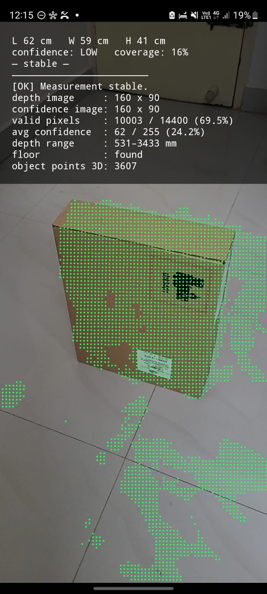

# AR Depth Object Measurement

An Android prototype that automatically estimates a standalone object's **Length, Width, and
Height** using the **ARCore Depth API**. The surveyor points the phone at an object sitting on the
floor and slowly walks around it — the bounding box stabilizes and the measurements appear. There is
no manual corner tapping.

It is part of the **Packing & Moving Survey** experiment. The goal is the *smallest* piece of
software that measures accurately while keeping smooth AR performance — not a general-purpose
scanner.

<p align="center">
  
</p>

<p align="center"><em>Live overlay — accumulated depth point cloud (green) with L/W/H, confidence, and coverage stats.</em></p>

## How it works

The pipeline is a chain of small, independently testable stages. Data flows once per processed
frame, throttled to about 4×/sec on the GL thread so rendering stays smooth.

```
Camera / Frame          CameraRenderer.kt        Draws camera background, drives session.update(),
                                                 overlays the point cloud.
   ↓
Depth Acquisition       DepthViewModel.kt        Owns the ARCore Session; acquires raw depth +
                        DepthStats.kt            confidence images; summarizes them.
   ↓
Point Cloud             DepthPointCloud.kt       Back-projects depth pixels → world-space 3D points,
                                                 dropping low-confidence and below-floor points.
   ↓
Object Isolation        ObjectIsolator.kt        Keeps points within a sphere of the nearest point
                                                 (the target object); drops walls/furniture.
   ↓
Temporal Accumulator    MeasurementStabilizer.kt EMA-smooths each dimension across frames, tracks
+ Measurement Smoothing                          angular coverage (12 wedges), gates on stability.
   ↓
Bounding Box            BoundingBox.kt           Gravity-aligned box: height = top − floor;
                                                 footprint = world X/Z spread.
   ↓
UI                      MainActivity.kt          Overlays L/W/H + confidence + coverage.
```

Supporting GL code lives in `PointCloudRenderer.kt`, `GlProgram.kt`.

## Key technical decisions

- **Gravity-aligned box, no PCA.** ARCore's world is +Y up, so height reads directly off the floor
  plane and the footprint is a simple axis-aligned X/Z spread. A rotated object over-estimates its
  footprint; the min-area-rectangle fix is deliberately deferred until measurements prove it matters.
- **Stability over instant readings.** Dimensions are exponential moving averages; a measurement is
  marked `stable` only after it holds within 5 mm for several consecutive updates.
- **Coverage as trust.** Coverage % is how many of 12 wedges around the object the camera has
  viewed — a face never seen can't be trusted. It's cheap: one `atan2` plus a bitmask, no per-frame
  allocation.
- **Floor-gated.** No measurement is produced until a horizontal plane (the floor) is found, since
  the object can't otherwise be separated from the ground.
- **Performance-minded.** Buffers are reused, the per-frame path allocates nothing beyond small
  result objects, and heavy work is throttled off the render cadence. Every measurement carries
  confidence, coverage, and a timestamp.

## Status

| Milestone | State |
|-----------|-------|
| Full pipeline built, compiles clean (`:app:compileDebugKotlin`) | ✅ Done |
| Validated on hardware (accuracy) | ⏳ Not yet — needs a depth-capable Android device |
| Automated tests (`BoundingBox`, `MeasurementStabilizer` are pure) | ⏳ Not yet |

## Requirements

- An **ARCore-supported Android device with the Depth API** — a standard emulator won't exercise the
  depth path.
- **JDK 17** (project uses the Gradle wrapper **8.9**; newer Gradle/JDK combos are incompatible with
  AGP 8.6.1).
- Android SDK with platform **android-34** and build-tools **34.0.0** (Kotlin 1.9.25, minSdk 24).

## Build & run

First run initializes `local.properties` (pointing Gradle at your Android SDK) and builds the debug
APK:

```sh
./initialize.sh
```

Or build directly with the wrapper and JDK 17:

```sh
export JAVA_HOME="$HOME/Library/Java/JavaVirtualMachines/jbr-17.0.14/Contents/Home"
./gradlew :app:assembleDebug
```

The APK lands at `app/build/outputs/apk/debug/app-debug.apk`. Install it on a depth-capable device
and grant camera permission, then point the phone at an object on the floor and walk slowly around
it.
